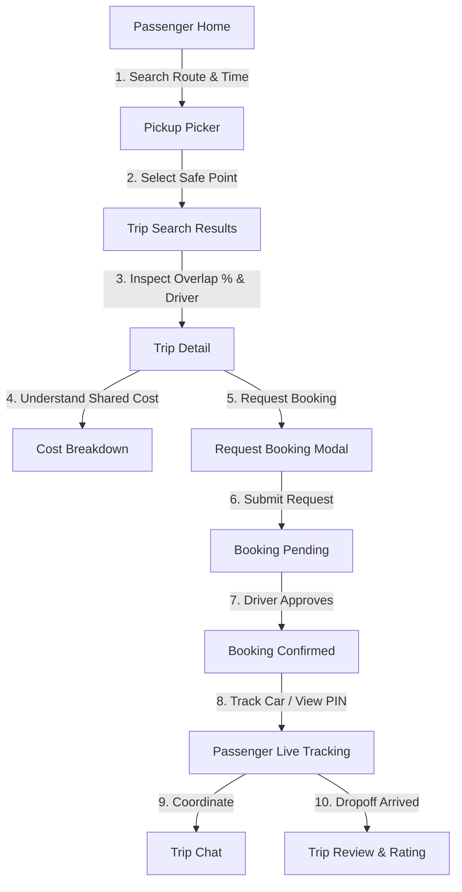
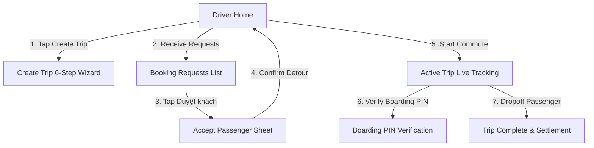

# RouteShare Mobile Experience Flow & Interaction Specification

This document details the end-to-end user journeys for **Passenger**, **Driver**, and **Shared Experiences**, aligned directly with the HTML design prototypes in `html/` and the application codebase.

---

## 1. Design System & Interaction Principles

- **Typography**: `Be Vietnam Pro` for crisp headers, body, and badges; `IBM Plex Mono` for currency values (`35.000 ₫`), PIN codes (`4821`), license plates (`51G-119.02`), and coordinates.
- **Color Tokens**:
  - `#0F9D76` (Primary Green) / `#0B7A5C` (Primary Deep / Text) / `#DDF3EA` (Soft Green Badge & Avatar)
  - `#EE7A22` (Warm Orange — Destination square pins, pending radar alert)
  - `#F4F7F5` (Canvas Background) / `#101B17` (High-contrast text) / `#4B5A54` & `#8A9993` (Subtitles & captions)
  - `#C22B35` (SOS & Danger actions)
- **Keyframe Animations**: `rs-ring`, `rs-ring2`, `rs-pop`, `rs-float`, `rs-pulse2`, `rs-shimmer`, `rs-spin`.
- **Form Factor**: Pixel-perfect 390×844px inner mobile viewport within a 410×864px rounded device frame with interactive role switcher and screen jumper.

---

## 2. Passenger Flow

### Screen Details:
1. **Passenger Home (`/passenger/home`)**
   - Header with user avatar (`MA`), greeting, notifications, and top wallet pill.
   - Search commute card with Origin/Destination swap button, date picker, time window chips, and seat selector.
   - Active high-overlap candidate trips rail (e.g. 94% overlap, 18.5 km).
2. **Pickup Location Picker (`/passenger/pickup-picker`)**
   - Interactive map with safe pickup points, avoiding no-stopping zones (*Cấm dừng đỗ*).
   - Filter tags: `Tất cả` | `Tránh cấm dừng đỗ`.
3. **Trip Search Results (`/passenger/results`)**
   - Filter chips: `Trùng tuyến cao nhất` | `Giờ khởi hành gần nhất` | `Chi phí tối ưu`.
   - Trip cards showing driver rating, verified badge, vehicle thumbnail, and route overlap breakdown.
4. **Trip Detail (`/passenger/trip/:id`)**
   - Full driver profile, vehicle specs, and stop-by-stop itinerary timeline.
   - Transparent cost-sharing breakdown (Fuel + BOT Tolls + Wear/Tear).
5. **Request Booking (`/passenger/request-booking/:id`)**
   - Seat count picker (1–3 seats), optional note to driver ("Em mang balo nhỏ, đứng ở cổng 2").
   - Non-charging guarantee reminder.
6. **Booking Pending (`/passenger/booking-pending/:id`)**
   - Pulsing radar circle animation with driver avatar and typing indicator.
   - 3-step progress track: `1. Gửi yêu cầu` $\rightarrow$ `2. Tài xế duyệt` $\rightarrow$ `3. Xác nhận`.
   - Instant demo trigger button to simulate immediate driver acceptance.
7. **Booking Confirmed (`/passenger/booking-confirm/:id`)**
   - Pop checkmark celebration animation (`rs-pop`).
   - 4-digit Boarding PIN code (`4821`) for safe pickup identification.
   - One-tap Call / Chat actions.
8. **Passenger Live Tracking (`/passenger/live-tracking`)**
   - Live GPS map with moving driver car, pulsing radius, and polyline route.
   - Real-time status card with dynamic ETA countdown.
   - Emergency SOS floating button with 24/7 hotline modal.

---

## 3. Driver Flow

### Screen Details:
1. **Driver Home (`/driver/home`)**
   - Compact wallet balance bar with one-tap top-up/detail navigation.
   - Quick CTA to create/publish a new commute.
   - Pending booking request cards showing overlap % and detour impact (+0.8 km, +3 min).
   - Today's active trip card with passenger boarding status.
2. **Create Trip Wizard (`/driver/create-trip`)**
   - **Step 1**: Origin & Destination input with AI popularity suggestion.
   - **Step 2**: Intermediate stops manager (Add/remove waypoints like *Cầu Sài Gòn*, *Lotte Mart*).
   - **Step 3**: Departure time & recurring weekly commute scheduler (`T2`–`CN`).
   - **Step 4**: Vehicle selection & open seat capacity (`1`–`4` seats).
   - **Step 5**: Fuel & shared contribution slider (`30k`–`65k` VND).
   - **Step 6**: Final trip review and one-tap publish.
3. **Booking Requests (`/driver/requests`)**
   - Categorized tabs: `Chờ duyệt` | `Đã nhận` | `Đã từ chối`.
   - Decision pair: Overlap percentage bar vs Driver detour (+km / +min).
4. **Accept Passenger Sheet (`/driver/approval` & modal)**
   - Before/After comparison: Original route (27.4 km / 52 min) $\rightarrow$ After pickup (28.5 km / 55 min).
   - Capacity chips indicating remaining free slots.
   - Passenger fare contribution summary.
5. **Active Trip Live Tracking (`/driver/active-trip` or `/shared/live-tracking`)**
   - 4-Phase state machine: `Sẵn sàng` $\rightarrow$ `Đang tới điểm đón` $\rightarrow$ `Khách đã lên xe` $\rightarrow$ `Đã tới nơi`.
   - Single evolving 60px primary action button.
   - Real-time metrics chip bar (Distance to pickup / Trip distance / Fare).

---

## 4. Shared Experiences

1. **Trip Chat (`/shared/chat/:id`)**
   - Real-time thread between driver and passenger with trip context header.
   - One-tap quick replies (*"Em đã ở điểm đón"*, *"Em tới sau 5 phút nữa"*, *"Em mặc áo sơ mi xanh"*).
   - Rich 220px GPS location card sharing.
2. **Boarding PIN Verification (`/shared/boarding-pin`)**
   - Passenger view: High-contrast 4-digit PIN display.
   - Driver view: 4-digit PIN input keypad with instant validation.
3. **Trip Complete & Rating (`/shared/trip-complete`)**
   - Settlement summary showing earnings/contribution.
   - 5-Star rating selector with compliment tag pills (*"Lái xe an toàn"*, *"Đúng giờ"*, *"Xe sạch sẽ"*).
   - Optional driver tipping selector.
4. **Wallet & VietQR Top-Up (`/wallet` & `/wallet/top-up`)**
   - VietQR / PayOS payment code generation for instant bank transfer.
   - Detailed ledger of completed trips and payouts.
5. **Vehicle KYC & Profile (`/driver/kyc` & `/profile`)**
   - CCCD and GPLX B2 verification status badges.
   - Vehicle registration card.
ooking
SF-14 — Driver Cancels Trip	Driver	Trip Detail → Cancel Trip → Reason → Confirm → Notify Passengers	Xử lý khi Driver không thể thực hiện Trip
SF-15 — Reschedule Trip	Driver	Upcoming Trip → Edit → Change Date/Time → Check Existing Bookings → Confirm → Notify Passengers	Điều chỉnh chuyến nhưng vẫn kiểm soát booking
SF-16 — Passenger Responds to Trip Change	Passenger	Notification → Trip Changed → Review New Time/Route → Accept Change / Cancel Booking	Cho Passenger xử lý khi Driver đổi lịch
SF-17 — Notifications	Passenger + Driver	Notification Center → Booking/Trip/Chat/Safety Notification → Open Related Screen	Trung tâm thông báo toàn hệ thống
SF-18 — Chat Before Trip	Passenger + Driver	Booking Confirmed → Chat → Coordinate Pickup → Share Location/Text	Hai bên thống nhất vị trí và thời gian đón
SF-19 — Share Trip	Passenger + Driver	Active Trip → Share Trip → Select Contact/App → Share Live Trip Link	Tăng an toàn trong chuyến
SF-20 — Trusted Contact	Passenger + Driver	Safety Settings → Trusted Contacts → Add Contact → Verify → Save	Dùng cho SOS và chia sẻ hành trình
SF-21 — Report User	Passenger + Driver	User/Trip → Report → Select Reason → Add Details → Submit	Báo cáo hành vi không phù hợp
SF-22 — Report Safety Incident	Passenger + Driver	Safety → Report Incident → Trip → Category → Description/Evidence → Submit	Báo cáo sự cố nghiêm trọng
SF-23 — Rating History	Passenger + Driver	Profile → Ratings → View Received/Given Ratings	Xem lịch sử trust/reputation
SF-24 — Trip History	Passenger + Driver	My Trips → Completed/Cancelled → Trip Detail	Xem lại các chuyến trước
SF-25 — Cost History	Passenger + Driver	Trip Detail → Cost Sharing → Previous Contributions	Theo dõi khoản chi phí đã chia sẻ